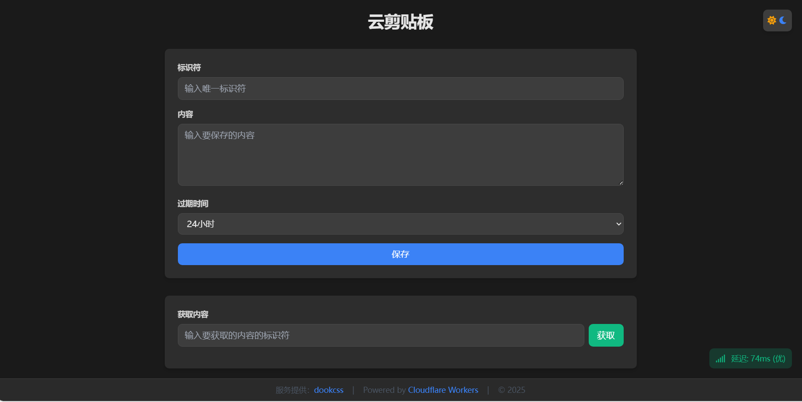

# 云剪贴板 (Web Clipboard)

一个基于 Cloudflare Workers 的在线剪贴板服务，支持跨设备文本共享、自定义过期时间和深色模式。

## 界面预览

### 桌面端
#### 浅色模式


主要功能：
- 顶部标题栏和主题切换
- 内容保存区域（标识符、内容输入、过期时间选择）
- 内容获取区域
- 右下角延迟显示
- 底部服务信息

#### 深色模式


特点：
- 自动适应系统主题
- 护眼深色配色
- 保持良好可读性
- 平滑切换动画

### 移动端
<div style="display: flex; justify-content: space-around; margin: 20px 0;">
  <div>
    <p align="center">浅色模式</p>
    
  </div>
  <div>
    <p align="center">深色模式</p>
    
  </div>
</div>

移动端特点：
- 完美适配各种屏幕尺寸
- 触控优化的交互体验
- 保持桌面端所有功能
- 更适合单手操作的布局

## 功能特点

- 🚀 **快速部署**：基于 Cloudflare Workers，无需服务器
- 🌐 **跨设备同步**：随时随地访问您的剪贴板内容
- 🎨 **深色模式**：支持自动/手动切换深色模式
- ⏱️ **自定义过期**：支持设置内容过期时间（1小时到30天）
- 📊 **延迟监控**：实时显示连接质量
- 🔒 **安全可靠**：基于 Cloudflare KV 存储，数据安全有保障
- 💻 **响应式设计**：完美支持移动端和桌面端

## 部署步骤

1. **准备工作**
   - 注册 [Cloudflare 账号](https://dash.cloudflare.com/sign-up)
   - 确保已启用 Cloudflare Workers 服务

2. **创建 Worker**
   ```bash
   # 在 Cloudflare Dashboard 中：
   1. 点击 "Workers & Pages"
   2. 点击 "Create Application"
   3. 选择 "Create Worker"
   ```

3. **创建 KV 命名空间**
   ```bash
   1. 在 Workers 页面点击 "KV"
   2. 点击 "Create Namespace"
   3. 命名为 "MY_KV_NAMESPACE"（或自定义名称）
   ```

4. **绑定 KV 命名空间**
   ```bash
   1. 进入您的 Worker 设置
   2. 点击 "Settings" -> "Variables"
   3. 在 "KV Namespace Bindings" 下点击 "Add binding"
   4. 变量名设置为 "MY_KV_NAMESPACE"
   5. 选择您刚创建的 KV 命名空间
   ```

5. **部署代码**
   - 将 `worker.js` 的内容复制到 Worker 编辑器中
   - 点击 "Save and deploy"

## 使用说明

1. **保存内容**
   - 输入唯一标识符
   - 输入要保存的内容
   - 选择过期时间
   - 点击保存

2. **获取内容**
   - 输入内容的标识符
   - 点击获取
   - 可以直接复制或删除内容

3. **主题切换**
   - 点击右上角的主题图标切换深色/浅色模式
   - 支持跟随系统主题自动切换

## 技术栈

- Cloudflare Workers
- Cloudflare KV
- TailwindCSS
- Font Awesome

## 服务提供

- 作者：[Your Name]
- 部署：Cloudflare Workers
- 版权所有 © 2025

## 优势特点

1. **零成本部署**
   - 利用 Cloudflare Workers 免费配额
   - 无需维护服务器
   - 自动扩展，高可用

2. **全球加速**
   - 依托 Cloudflare 全球边缘网络
   - 极低延迟
   - 自动就近访问

3. **安全性**
   - 自动 HTTPS
   - DDoS 防护
   - 数据加密存储

4. **易用性**
   - 直观的用户界面
   - 响应式设计
   - 快捷的操作方式

## 注意事项

- 免费版 Workers 有每天 100,000 请求的限制
- KV 存储有容量限制，建议定期清理过期数据
- 建议在生产环境中限制 CORS 域名

## 许可证

MIT License
